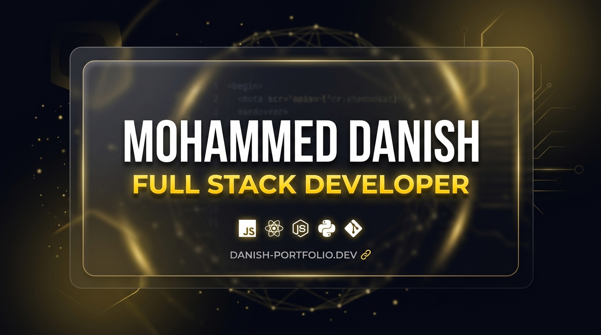

# 🚀 Mohammed Danish — Developer Portfolio Platform

<p align="center">
  
</p>

<p align="center">
  <b>A Production-Grade, Full-Stack Dynamic Portfolio & Self-Managing Platform</b><br />
  Powered by <b>React (Vite)</b>, <b>Node.js (Express)</b>, and <b>MongoDB Atlas</b> — featuring a secret JWT-protected Admin Console, Offline Caching, and custom Glassmorphic Dark UI.
</p>

<p align="center">
  <a href="https://mohammeddanish-portfolio.netlify.app"></a>
  <a href="https://portfolio-db-1jg2.onrender.com"></a>
  <a href="https://github.com/mddanish222/my-portfolio"></a>
  
  
</p>

---

### 🔗 Production Live Links
- 🌐 **Live Portfolio (Netlify)**: [https://mohammeddanish-portfolio.netlify.app](https://mohammeddanish-portfolio.netlify.app)
- ⚙️ **Backend REST API (Render)**: [https://portfolio-db-1jg2.onrender.com](https://portfolio-db-1jg2.onrender.com)

---

## ✨ Key Features & Architecture

### 🌐 Public Portfolio (Frontend SPA)
- **Glassmorphic Amber-Gold Dark Theme**: Modern `#07070E` dark design system with backdrop blurs, glow accents (`#FFB400`), and smooth micro-animations.
- **Dynamic Content Sections**: **Projects**, **Skills**, **Experience**, **Education**, and **Certifications** fetched live from MongoDB Atlas.
- **Offline Caching & Resiliency**: Built-in `localStorage` caching inside `useFetch` so all content remains visible instantly even when offline or backend sleeping.
- **Custom Offline Resume Download Modal**: Interactive warning modal with a top-right ✕ button when network is offline (`"Please check your internet connection"`).
- **Custom Monogram Favicon & SEO OpenGraph Cards**: Features a signature `<MD />` SVG favicon and OpenGraph social sharing preview banners for LinkedIn & Twitter.
- **Responsive Layout**: Designed for seamless viewing across mobile phones, tablets, and desktop displays.

### 🔒 Secret Admin Console (Management SPA)
- **Secret Obscured Route**: Configurable via `VITE_ADMIN_PATH` so the login route is never exposed.
- **Brute-Force Rate Limiter**: Locks IP for 15 minutes after 5 consecutive failed login attempts (`429 Too Many Requests`).
- **JWT Authentication**: Password verification issuing 12-hour signed JWT tokens with auto-logout protection.
- **Dynamic Content Managers**:
  - **Resume PDF Manager**: Base64 PDF upload, download, and delete manager.
  - **Profile Photo Manager**: Client-side image validation and Base64 avatar uploader.
  - **About Me Manager**: Live editing form for bio paragraphs and key stat boxes (Projects, CGPA, PUC, Year).
  - **CRUD Manager**: Generic schema-driven form system for Projects, Skills, Experience, Education, and Certifications.

### ⚙️ Backend API (Node.js + Express + Mongoose)
- **MongoDB Atlas Integration**: Powered by Mongoose models (`Project`, `Skill`, `Experience`, `Education`, `Certification`, `Setting`) with `toJSON` schema transforms outputting `id` and `desc`.
- **Backward-Compatible Schema**: 100% API compatibility layer for seamless database queries.
- **Automated Seeding Script**: `npm run seed` populates database with production resume records.
- **Comprehensive Unit Testing**: 52/52 Jest unit tests passing across 7 test suites.

---

## 🛠️ Technology Stack

| Layer | Technology |
|---|---|
| **Frontend UI** | React 18, Vite, React Router DOM, Custom Glassmorphic CSS |
| **Backend API** | Node.js, Express.js, Mongoose ODM |
| **Database** | MongoDB Atlas (Cloud Cluster) |
| **Authentication** | JSON Web Tokens (JWT) & In-Memory Rate Limiting |
| **Mobile Companion** | Expo (React Native) |
| **Testing** | Jest, Supertest |
| **Hosting** | Netlify (Frontend), Render / Railway (Backend) |

---

## 🧩 Project Structure

```text
my-portfolio/
 ├── backend/
 │    ├── app.js               → Express application, REST routes & rate limiter
 │    ├── server.js             → Database connection & server entry point
 │    ├── db/
 │    │    ├── connect.js       → Mongoose MongoDB Atlas helper
 │    │    ├── models/          → 6 Mongoose Schemas (Project, Skill, Experience, etc.)
 │    │    └── seedMongo.js     → MongoDB Atlas data seeding script
 │    ├── middleware/
 │    │    └── auth.js          → JWT verification middleware
 │    └── __tests__/            → Jest API test suites (52/52 tests)
 │
 ├── frontend/
 │    ├── index.html            → OpenGraph SEO Meta Tags & Favicon link
 │    ├── public/
 │    │    ├── favicon.svg      → Signature <MD /> Gold Monogram Favicon
 │    │    └── og-preview.jpg   → Social sharing card image
 │    └── src/
 │         ├── api/client.js    → Centralized API client & BASE_URL config
 │         ├── hooks/useFetch.js → Custom data fetching hook with offline caching
 │         ├── components/
 │         │    ├── Navbar.jsx, Projects.jsx, Skills.jsx, Exce.jsx
 │         │    └── admin/      → Secret Admin Console components
 │         │         ├── AdminLayout.jsx, AdminLogin.jsx
 │         │         ├── ResumeManager.jsx, AboutMeManager.jsx
 │         │         └── ProfilePhotoManager.jsx
 │         ├── main.jsx         → React ErrorBoundary & Routing setup
 │         └── App.jsx          → Public portfolio layout composition
 │
 ├── mobile/                    → React Native (Expo) Companion Mobile App
 │    ├── App.js                → Mobile Portfolio layout (reads same backend API)
 │    ├── app.json              → Expo configuration
 │    └── package.json          → Expo & React Native dependencies
```

---

## 🚀 Getting Started Locally

### 1. Clone the Repository
```bash
git clone https://github.com/mddanish222/my-portfolio.git
cd my-portfolio
```

### 2. Backend Setup
```bash
cd backend
npm install
```

Create a `.env` file in the `backend/` directory:
```env
PORT=5000
MONGODB_URI=your_mongodb_atlas_connection_string
JWT_SECRET=your_jwt_secret_key
ADMIN_PASSWORD=your_admin_password
```

Seed the MongoDB Atlas database:
```bash
npm run seed
```

Start the backend server:
```bash
npm start
```

### 3. Frontend Setup
In a new terminal window:
```bash
cd frontend
npm install
```

Create a `.env` file in the `frontend/` directory:
```env
VITE_API_URL=http://localhost:5000
VITE_ADMIN_PATH=/your-secret-admin-path
```

Start the Vite development server:
```bash
npm run dev
```

Open **`http://localhost:5173`** in your browser to view the portfolio live!

### 4. Mobile App Setup (React Native / Expo)
In a new terminal window:
```bash
cd mobile
npm install
npm start
```
Scan the generated QR code with the **Expo Go** app on your iOS/Android phone to run your portfolio natively on mobile!

---

## 🧪 Running Unit Tests

Run the full backend test suite:
```bash
cd backend
npm test
```

---

## 📄 License

This project is licensed under the [MIT License](LICENSE).  
Designed & Developed with ❤️ by **Mohammed Danish**.
